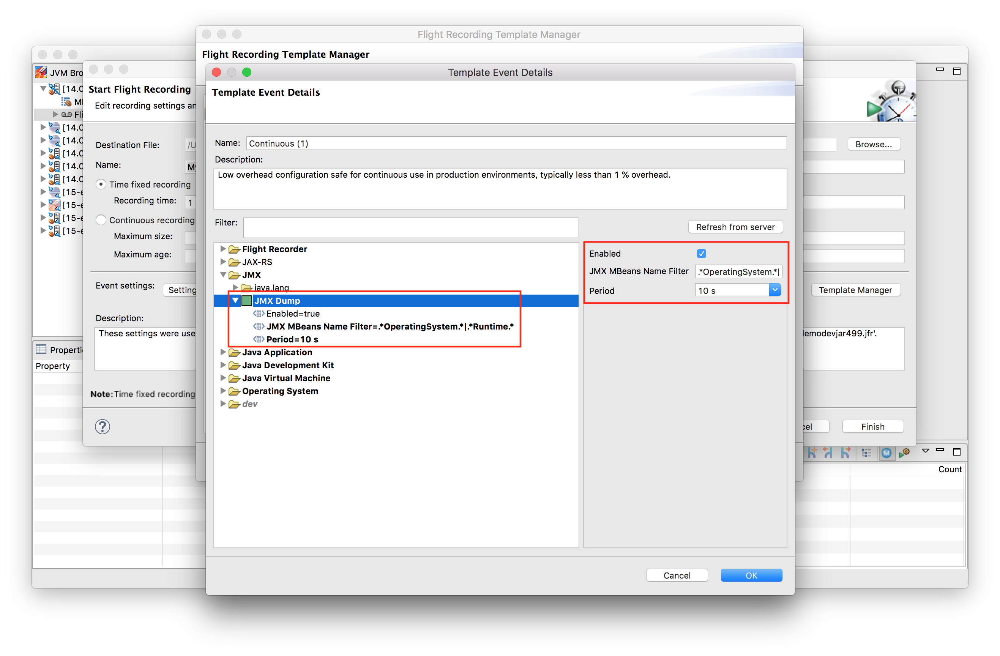
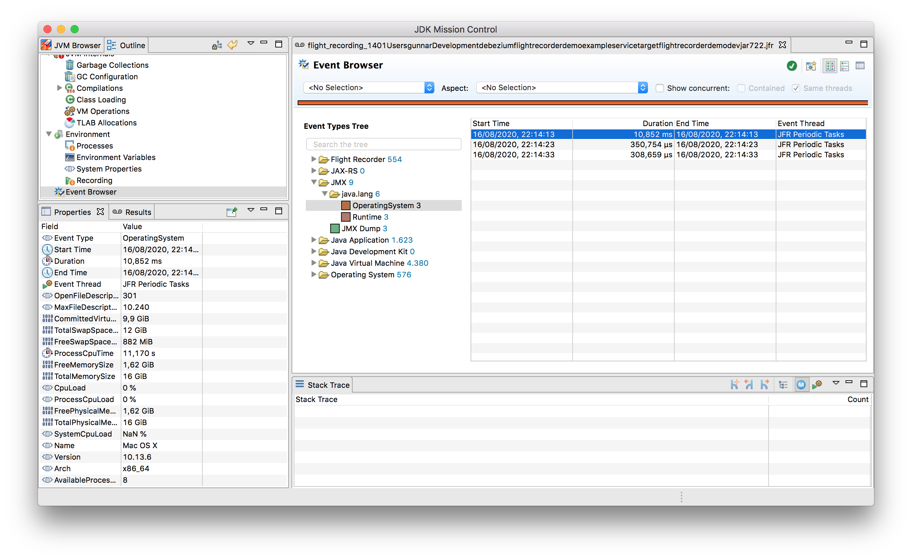

# JmFrX - A bridge for capturing JMX data with JDK Flight Recorder

The JmFrX project allows to periodically capture JMX MBeans and emit a corresponding [JDK Flight Recorder](https://openjdk.java.net/jeps/328) (JFR) event.
This allows to

* Access JMX data from offline JFR recording files in situations where you cannot directly connect to JMX
* Emit JMX data via the JFR event streaming API ([JEP 349](https://openjdk.java.net/jeps/349))

To learn more about JFR itself, please refer to this [blog post](https://www.morling.dev/blog/rest-api-monitoring-with-custom-jdk-flight-recorder-events/).

## Usage

This project requires OpenJDK 11 or later at runtime.

JmFrX is not yet available from Maven Central yet;
in the meantime you can obtain snapshot builds from [JitPack](https://jitpack.io).
To so, add the following dependency to your project's _pom.xml_:

```xml
...
<dependency>
  <groupId>com.github.gunnarmorling</groupId>
  <artifactId>jmfrx</artifactId>
  <version>master-SNAPSHOT</version>
</dependency>
...
```

Alternatively, build JmFrX from source (see below) yourself and add the following dependency to your project's _pom.xml_:

```xml
...
<dependency>
  <groupId>dev.morling.jmfrx</groupId>
  <artifactId>jmfrx</artifactId>
  <version>1.0-SNAPSHOT</version>
</dependency>
...
```

Then, register the JmFrX event type with Flight Recorder in the start-up routine of your program,
e.g. its main method, the static initializer of a class loaded early on, an eagerly initialized Spring or CDI bean, etc.
A Java agent for this purpose will be provided as part of this project soon.
When using Quarkus, an application start-up event listener can be used like so:

```java
@ApplicationScoped
public class EventRegisterer {

  public void registerEvent(@Observes StartupEvent se) {
    Jmfrx.getInstance().register();
  }

  public void unregisterEvent(@Observes ShutdownEvent se) {
    Jmfrx.getInstance().unregister();
  }
}
```

Start your application.

Now create a JFR configuration file, enabling the JmFrX event type.
To do so, open [JDK Mission Control](https://openjdk.java.net/projects/jmc/), and choose your application in the JVM Browser.
Then follow these steps:

* Right-click the JVM -> _Flight Recorder_ -> _Start Flight Recording..._
* Click on _Template Manager_
* Copy the _Continuous_ setting and _Edit_ this copy
* Expand the _JMX_ and _JMX Dump_ nodes
* Make sure the event is _Enabled_, choose a period for dumping the chose JMX MBeans (defaults to 60 s) and select the MBeans to be dumped by means of a regular expression, which matches one or more JMX object names:



* Click _OK_ and _OK_
* Make sure that the template you edited is selected under _Event settings_
* Click _Finish_ to begin the recording

Once the recording is complete, open the recording file in JDK Mission Control and go to the _Event Browser_.
You should see periodic events corresponding to the selected MBeans under the _JMX_ node:



When not using JDK Mission Control to initiate recordings, but the _jcmd_ utility,
also create a configuration as described above.
Then export the file from the template manager and specify its name to _jcmd_ via the _settings=/path/to/settings.jfc_ parameter.

## Build

This project requires OpenJDK 14 or later for its build.
Apache Maven is used for the build.
Run the following to build the project:

```shell
mvn clean install
```

## Related Work

JDK Mission Control project lead Marcus Hirt discussed a similar project in a [blog post](http://hirt.se/blog/?p=689) in 2016.
But unlike the implementation described by Marcus in this post,
JmFrX is based on the public and supported APIs for defining, configuring and emitting JFR events, as available since OpenJDK 11.

## License

This code base is available ander the Apache License, version 2.
